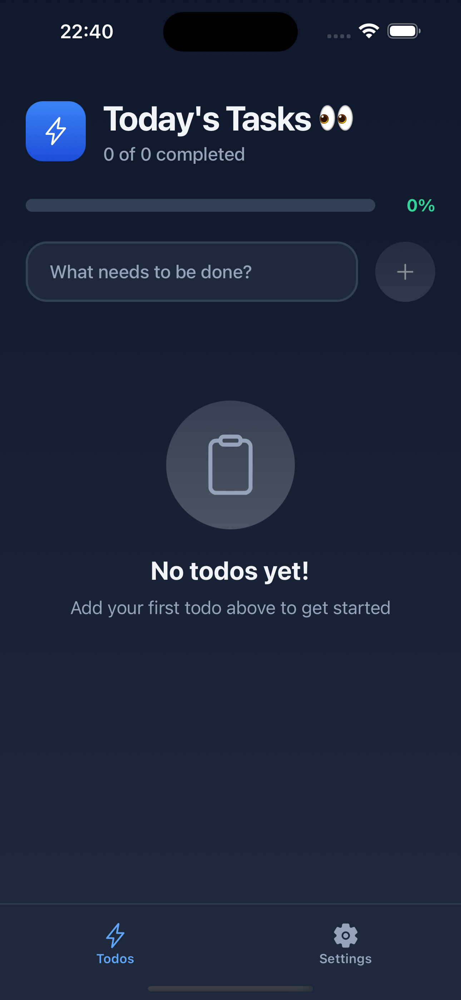
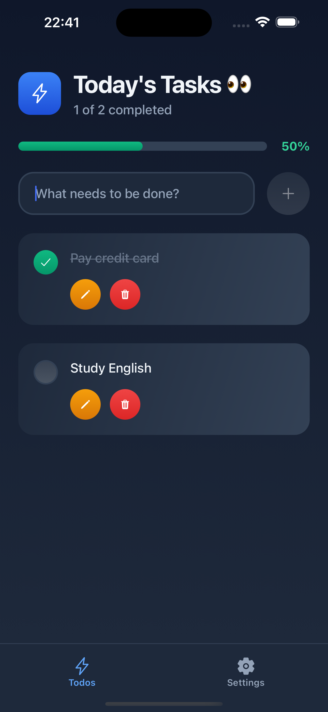
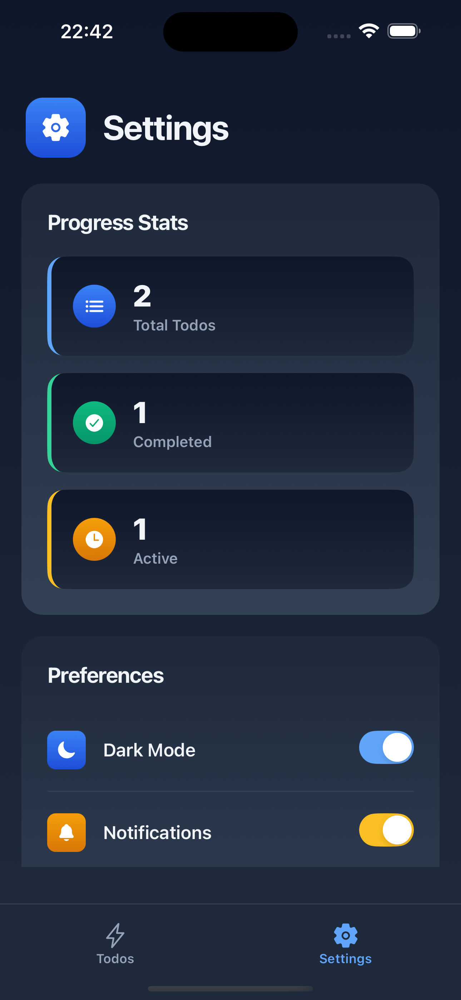

# Todo List App (React Native + Expo + Convex)

A simple and efficient Todo List mobile application built with React Native, Expo, and Convex for real-time backend synchronization.

The app is organized into two main tabs:
    Home: Create, edit, and delete tasks.
    Settings: Toggle dark mode, delete all tasks, and view task statistics.

## 🚀 Features

Home Tab

    * Add new tasks
    
    * Edit existing tasks
    
    * Delete individual tasks
    
    * Tasks synced in real time using Convex
    

Settings Tab

    * Enable/disable Dark Mode
    
    * Delete all tasks at once
    
    * View a task report (total, pending, completed)

## 🛠️ Tech Stack

React Native
Expo
TypeScript
Convex (Backend as a Service)
React Navigation (Bottom Tabs)

## 🖼️ Screenshots

## 📦 Installation

Clone the repository:

git clone https://github.com/julioandherson/todo-app-react-native.git
cd todo-app-react-native

Install dependencies:
npm install

Install Convex CLI (if not installed):
npm install -g convex

## ▶️ How to Run the Project (Expo + Convex)

The app requires two processes running at the same time:
✔️ The Convex backend
✔️ The Expo app

1. Start Convex

Inside the project folder, run:
npx convex dev

This will start the Convex backend on a local development URL and watch for changes in your convex/ folder.

Keep this terminal open.

2. Start the Expo App

Open a new terminal tab/window and run:
npx expo start

Expo will open a local server where you can:

Press i to run on iOS Simulator

Press a to run on Android Emulator

Or scan the QR code using Expo Go on your phone

Make sure Convex is already running so the app can connect to it.
